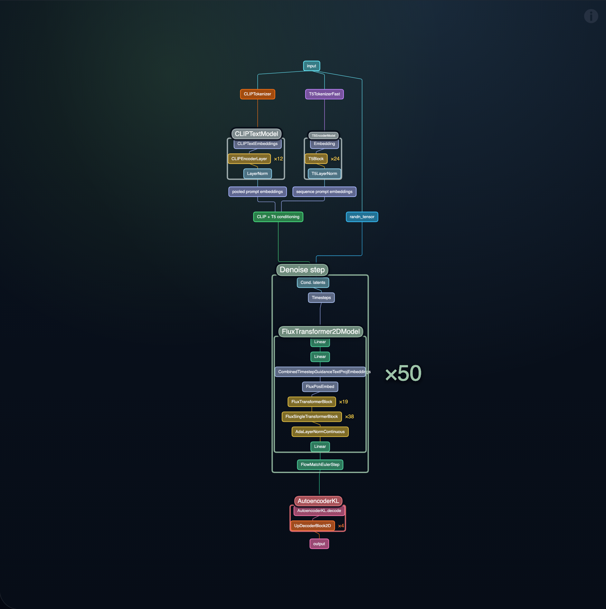

# Layerdex

**HF Model Architecture** — capture Hugging Face model architecture diagrams as PNG and structured JSON via [hfviewer](https://hfviewer.com/).

[English](./README.md) | [简体中文](./README.zh-CN.md)

**Repository:** [github.com/ingeniousfrog/Layerdex](https://github.com/ingeniousfrog/Layerdex)

---

## What It Does

- Opens `https://hfviewer.com/<owner>/<model>` for any public Hugging Face model
- Sets granularity (Block / Detailed / Fine / Level 4+)
- Exports a cropped architecture graph PNG
- Parses the right-side info panel into JSON (node count, op types, vocab, attributes, operation distribution)
- Works as an agent skill (Claude Code, Codex CLI, Cursor) or as a standalone CLI

Give it a model id such as `zai-org/GLM-5.2` or a Hugging Face / hfviewer URL.

## Live Example

**Input:** `black-forest-labs/FLUX.1-dev` at Fine granularity (`--level fine`)

**Command:**

```sh
npm install
npm run capture -- black-forest-labs/FLUX.1-dev --out artifacts/flux --level fine
```

**Output diagram:**



**Output JSON (excerpt):**

```json
{
  "schemaVersion": "1.0.0",
  "source": {
    "modelId": "black-forest-labs/FLUX.1-dev",
    "hfviewerUrl": "https://hfviewer.com/black-forest-labs/FLUX.1-dev",
    "requestedLevel": 3,
    "granularityLabel": "Fine"
  },
  "model": {
    "title": "FLUX.1-dev model",
    "nodeCount": 27,
    "operationTypeCount": 25,
    "tokenVocab": 49408
  },
  "operationTypes": [
    { "name": "Linear", "percent": 11.1 },
    { "name": "Input", "percent": 3.7 },
    { "name": "CLIPTokenizer", "percent": 3.7 },
    { "name": "CLIPTextEmbeddings", "percent": 3.7 },
    { "name": "CLIPEncoderLayer", "percent": 3.7 }
  ]
}
```

Full sample: [`skills/hf-model-architecture/examples/flux1-dev-level3-info.json`](./skills/hf-model-architecture/examples/flux1-dev-level3-info.json)

## Quick Start

```sh
git clone https://github.com/ingeniousfrog/Layerdex
cd Layerdex
npm install
npx playwright install chromium
npm test
npm run capture -- zai-org/GLM-5.2 --out artifacts/glm-5.2 --level 4
```

## Install as Agent Skill

### Prerequisites

- Node.js 18+
- `npm install` (from repo root)
- `npx playwright install chromium`

### Claude Code / Codex CLI / Cursor

```sh
git clone https://github.com/ingeniousfrog/Layerdex /tmp/layerdex
/tmp/layerdex/skills/hf-model-architecture/install.sh --all
```

Or install to a single host:

```sh
./skills/hf-model-architecture/install.sh --claude   # ~/.claude/skills/
./skills/hf-model-architecture/install.sh --codex    # ~/.codex/skills/
./skills/hf-model-architecture/install.sh --cursor   # ~/.cursor/skills/
```

**Important:** Do not install into `~/.cursor/skills-cursor/` — that directory is reserved for Cursor built-in skills.

### One-liner

```sh
curl -fsSL https://raw.githubusercontent.com/ingeniousfrog/Layerdex/main/skills/hf-model-architecture/install.sh | bash
```

Use `--link` with `install.sh` to symlink instead of copying.

## Invoke

### With an agent (automatic)

The skill description triggers when you mention Hugging Face model ids, architecture graphs, or hfviewer URLs:

> Capture a Level 4 architecture graph for zai-org/GLM-5.2 and summarize the operation types.

### With an agent (explicit)

> Use hf-model-architecture to capture black-forest-labs/FLUX.1-dev at Fine granularity.

Agent instructions live in [`skills/hf-model-architecture/SKILL.md`](./skills/hf-model-architecture/SKILL.md).

### Standalone CLI

```sh
npm run capture -- zai-org/GLM-5.2 --out artifacts/glm-5.2 --level 4
```

Or via npx after publishing:

```sh
npx hf-model-architecture-skill zai-org/GLM-5.2 --out ./artifacts --level 4
```

## CLI Reference

```
Usage:
  npm run capture -- <model-id-or-url> [options]

Options:
  --out <dir>       Output directory (default: current directory)
  --level <value>   UI level number or block/detailed/fine (default: 4)
  --width <px>      Browser viewport width (default: 2048)
  --height <px>     Browser viewport height (default: 1152)
  --scale <n>       Device scale factor for screenshot fallback (default: 2)
  --timeout <ms>    Wait budget for hfviewer rendering (default: 120000)
  --padding <px>    Cropped graph padding for hfviewer API export (default: 24)
  --headed          Show the browser while capturing
  --help            Show help
```

Accepted inputs: `owner/model`, `https://huggingface.co/<owner>/<model>`, or `https://hfviewer.com/<owner>/<model>`.

## Output Contract

Each capture produces two files:

- `<slug>-level<N>-structure.png` — cropped architecture graph
- `<slug>-level<N>-info.json` — structured metadata

Key JSON fields:

| Field | Description |
|-------|-------------|
| `source.modelId` | Normalized Hugging Face model id |
| `source.hfviewerUrl` | Direct hfviewer URL |
| `source.requestedLevel` / `source.hfviewerLevel` | User-facing vs internal granularity |
| `artifacts.diagramPng` | Path to the PNG |
| `model.nodeCount` / `model.operationTypeCount` / `model.tokenVocab` | Parsed summary stats |
| `model.attributes` | Key/value pairs from the right panel |
| `operationTypes[]` | Operation name and percentage distribution |
| `warnings[]` | Non-fatal extraction or export issues |

Full schema: [`skills/hf-model-architecture/references/hfviewer-output.schema.json`](./skills/hf-model-architecture/references/hfviewer-output.schema.json)  
Field guide: [`skills/hf-model-architecture/references/output-json.md`](./skills/hf-model-architecture/references/output-json.md)

## Troubleshooting

| Symptom | Fix |
|---------|-----|
| `Playwright is required` | Run `npm install` from repo root |
| Browser launch fails | Run `npx playwright install chromium` |
| `hfviewer only exposes levels 0-N` | Lower `--level` to what the model supports |
| `hfviewer info panel was not found` | Confirm the model is public and renders on hfviewer |
| `exportMethod: element-screenshot` in JSON | Non-fatal fallback; PNG is still valid |
| Gated / private model | Not supported — hfviewer cannot render it |

Use `--headed` to watch the browser and `--timeout 180000` for slow models.

## Publish and Share

### GitHub

1. Push to `main` and add topics: `claude-skill`, `codex-skill`, `cursor-skill`, `agent-skill`, `huggingface`, `model-visualization`.
2. Update the GitHub repo **About** description to match the current skill focus.

### Claude Code marketplace

**Do not** submit to [obra/superpowers](https://github.com/obra/superpowers) core — third-party integrations are rejected.

Target [obra/superpowers-marketplace](https://github.com/obra/superpowers-marketplace) instead. Fork it, add a plugin entry pointing to `https://github.com/ingeniousfrog/Layerdex.git`, and open a PR with install evidence and the live example PNG.

Users can also install directly:

```sh
git clone https://github.com/ingeniousfrog/Layerdex /tmp/layerdex
/tmp/layerdex/skills/hf-model-architecture/install.sh --all
```

### npm

`npm publish` requires a manual npm account setup (`npm login`). Publish from the skill directory:

```sh
cd skills/hf-model-architecture
npm publish --access public
```

Users still need `npx playwright install chromium` after install.

## Repository Layout

```
Layerdex/
├── README.md                          # Documentation (this file)
├── README.zh-CN.md                    # Chinese documentation
├── skills/hf-model-architecture/
│   ├── SKILL.md                       # Agent instructions (not user docs)
│   ├── scripts/capture-hfviewer.mjs   # Playwright automation
│   ├── examples/                      # Sample PNG + JSON
│   ├── references/                    # Output schema
│   ├── install.sh                     # Install to Claude/Codex/Cursor
│   └── test/                          # Unit tests
└── package.json                       # Root scripts: npm test, npm run capture
```

## Boundaries

Layerdex depends on hfviewer rendering and metadata. It does not download model weights, infer architecture from tensor names, or maintain a separate visualization engine.

## License

Apache-2.0 — see [LICENSE](./LICENSE).
